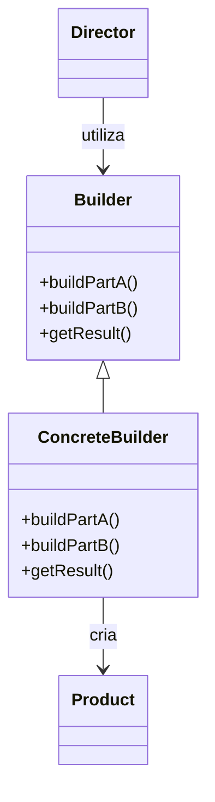

# Padrão de Projeto: Builder 📚

## Índice

- [1. Contextualização](#1-contextualização)
- [2. Definição do Padrão Builder](#2-definição-do-padrão-builder)
  - [2.1 Análise e Explicação da Definição](#21-análise-e-explicação-da-definição)
- [3. Resolução de Problemas com o Padrão Builder](#3-resolução-de-problemas-com-o-padrão-builder)
  - [3.1 Problemas que o Builder Soluciona](#31-problemas-que-o-builder-soluciona)
  - [3.2 Exemplo Lúdico](#32-exemplo-lúdico)
  - [3.3 Interpretação do Exemplo](#33-interpretação-do-exemplo)
- [4. Aplicações em Sistemas Reais](#4-aplicações-em-sistemas-reais)
- [5. Representação de UML](#5-representação-de-uml)
- [6. Exemplo de Código (Orientado a Objetos)](#6-exemplo-de-código-orientado-a-objetos)
- [7. Conclusão](#7-conclusão)
- [8. Referências](#8-referências)

   
### 1. Contextualização

O padrão de projeto **Builder**, pertencente ao grupo dos **padrões criacionais**, tem como principal objetivo a construção de objetos complexos, permitindo que sua criação seja realizada de forma controlada, passo a passo, e com possibilidade de variações estruturais sem comprometer a consistência do objeto final.

Esse padrão se destaca por **separar a construção de um objeto da sua representação final**, viabilizando que diferentes representações de um mesmo objeto possam ser produzidas utilizando o mesmo processo de construção. Tal característica é especialmente relevante em sistemas que lidam com a criação de objetos com **múltiplos atributos opcionais ou com diferentes formas de configuração**, onde o uso de construtores convencionais se torna inadequado ou até inviável.

A estrutura típica do padrão envolve quatro elementos principais: _**Builder (interface ou classe abstrata)**_, que define as etapas de construção do produto; _**ConcreteBuilder**_, que implementa essas etapas específicas; _**Product**_, que representa o objeto final construído; e, opcionalmente, um _**Director**_, responsável por controlar a ordem de execução das etapas de construção. Essa organização favorece a reutilização do processo construtivo, promovendo a manutenção da coesão e da legibilidade do código.

O uso do padrão Builder é especialmente indicado quando há necessidade de criar objetos imutáveis ou configuráveis, com muitas combinações possíveis de atributos, o que evita o uso de longos construtores (também conhecidos como *telescoping constructors*) ou a criação excessiva de subclasses para representar variações de configuração. Além disso, seu uso pode ser estendido a contextos onde se deseja implementar uma interface fluente (*fluent interface*), tornando o código mais expressivo e compreensível.

No contexto de desenvolvimento com linguagens orientadas a objetos, como **Java** e **C#**, o Builder é amplamente aplicado em frameworks, APIs e sistemas corporativos, sendo inclusive adotado em bibliotecas modernas, como parte das boas práticas de engenharia de software para a construção de objetos complexos.

Em síntese, o padrão Builder promove a **flexibilidade, reutilização e clareza na construção de objetos**, sendo uma solução eficaz para problemas relacionados à complexidade estrutural e à variabilidade na configuração de instâncias em aplicações orientadas a objetos.

---

### 2. Definição do Padrão Builder

O **padrão Builder** é um **padrão de projeto criacional** que **define um processo para construir objetos complexos passo a passo**, **separando a construção do objeto da sua representação**, de modo que **o mesmo processo de construção possa criar diferentes representações** de um objeto.  

### 2.1 Análise e Explicação da Definição

| **Trecho da definição** | **Explicação** |
|--------------------------|----------------|
| **“padrão de projeto criacional”** | Indica que o Builder pertence à categoria de padrões que tratam da **forma como os objetos são criados**, oferecendo maior controle sobre o processo de instanciação. |
| **“define um processo para construir objetos complexos”** | Refere-se ao fato de que o Builder estabelece uma **sequência estruturada de etapas** que guiam a criação de objetos que possuem múltiplas partes ou configurações. |
| **“passo a passo”** | A construção ocorre de maneira **incremental e ordenada**, permitindo montar o objeto gradualmente, adicionando partes ou configurando propriedades a cada etapa. |
| **“separando a construção do objeto da sua representação”** | Significa que o **processo de construção** (a lógica de montagem) é **independente da estrutura interna** do objeto final. Assim, quem constrói (Builder) é distinto de quem define o que o objeto é (Product). |
| **“de modo que o mesmo processo de construção possa criar diferentes representações”** | Implica que **um mesmo conjunto de etapas** pode ser utilizado para produzir **variações do produto final**, dependendo do tipo de Builder empregado. |

---

### 3. Resolução de Problemas com o Padrão Builder

### 3.1 Problemas que o Builder Soluciona

O **padrão Builder** é especialmente útil quando a criação de um objeto envolve **muitos detalhes, etapas ou combinações diferentes**.  
Ele organiza o processo de construção de forma **gradual, estruturada e compreensível**, evitando que o código se torne confuso ou difícil de manter.

Em situações comuns, a criação de um objeto pode exigir o fornecimento de diversos parâmetros — muitos deles opcionais —, o que resulta em construtores longos, difíceis de ler e propensos a erros.  
O Builder soluciona esse problema ao **permitir a criação do objeto passo a passo**, por meio de métodos descritivos e independentes, até que ele esteja completamente configurado.

### 3.2 Exemplo Lúdico

Imagine que você está **montando um lanche em uma lanchonete**.

Sem o padrão Builder, seria como se o atendente pedisse que você dissesse **tudo de uma vez**, na ordem exata, sem esquecer nada:

> “Quero um pão, com carne dupla, queijo cheddar, alface, tomate, maionese especial, e batata grande no combo, com refrigerante médio.”

Esse tipo de pedido funciona, mas é **fácil se confundir**, esquecer um item ou errar a sequência.  
Além disso, se o atendente quiser oferecer outro tipo de combo, ele precisará **repetir todo o processo**.

Agora imagine que a lanchonete adota um **sistema de montagem passo a passo** — isso seria o equivalente ao padrão Builder:

1. Primeiro, você escolhe o **tipo de pão**.  
2. Depois, o **tipo de carne**.  
3. Em seguida, os **complementos** (queijo, salada, molhos).  
4. Por fim, o **acompanhamento e a bebida**.  

No final, o atendente (ou o “Builder”) monta o seu lanche exatamente como você definiu, **de forma organizada, previsível e flexível**.

### 3.3 Interpretação do Exemplo

| **Aspecto** | **Sem Builder (pedido direto)** | **Com Builder (montagem passo a passo)** |
|--------------|--------------------------------|------------------------------------------|
| **Forma de construção** | Tudo de uma vez, exigindo atenção à ordem e aos detalhes. | Feito em etapas independentes e lógicas. |
| **Flexibilidade** | Difícil de adaptar — qualquer variação exige um novo pedido completo. | Fácil de personalizar — cada parte pode ser alterada separadamente. |
| **Clareza** | O pedido é longo e pode ser confuso. | Cada decisão é feita de forma explícita e intuitiva. |
| **Resultado final** | Um lanche montado corretamente apenas se tudo foi informado na ordem certa. | Um lanche montado de forma controlada e sob medida. |

### 4. Aplicações em Sistemas Reais
<p align="justify">
O padrão de projeto Builder é amplamente empregado em sistemas que demandam a criação de objetos complexos e configuráveis, oferecendo controle sobre a sequência e a flexibilidade na montagem de componentes. Seu uso é comum em frameworks e bibliotecas modernas, especialmente em linguagens orientadas a objetos como Java, C# e Python.
  
  Abaixo estão alguns exemplos práticos de sistemas e contextos que utilizam o padrão Builder:
</p>

| **Exemplo / Sistema** | **Descrição da Aplicação do Padrão Builder** |
|------------------------|----------------------------------------------|
| **StringBuilder (Java)** | Utilizado para construir cadeias de caracteres de forma eficiente, evitando a criação repetitiva de novos objetos `String`. |
| **AlertDialog.Builder (Android)** | Permite construir interfaces de diálogo passo a passo, definindo título, mensagem, botões e comportamentos antes de exibir o resultado final. |
| **HttpRequest Builders (Java e C#)** | Usado na criação de requisições HTTP complexas, onde parâmetros como cabeçalhos, corpo e métodos HTTP são definidos gradualmente e de forma fluente. |
| **Geração de relatórios personalizados** | Facilita a montagem de estruturas de dados e layouts modulares, adaptando-se a diferentes tipos de relatórios corporativos. |
| **Construção de objetos JSON em APIs REST** | Permite criar representações JSON dinâmicas e bem estruturadas, mantendo o código limpo e legível. |
| **Configuração de pipelines de dados em sistemas distribuídos** | Empregado para compor etapas de processamento e integração de forma controlada e extensível. |
| **Integração com frameworks de injeção de dependência e persistência** | Garante um processo de instanciação previsível e modular, comum em arquiteturas corporativas e orientadas a componentes. |

<p align="justify">
Assim o padrão Builder demonstra grande aplicabilidade prática, fornecendo uma abordagem clara, escalável e modular para lidar com a complexidade na criação de objetos, fortalecendo o design e a manutenibilidade de sistemas reais.
</p>

### 5. Representação de UML



- **Director**: Controla o processo de construção.
- **Builder**: Interface/abstração das etapas de construção.
- **ConcreteBuilder**: Implementa as etapas específicas.
- **Product**: Objeto final construído.

### 6. Exemplo de Código (Orientado a Objetos)

Exemplo simples em Java do padrão Builder para montar um "Sanduiche":

```java
class Sanduiche {
    private String pao;
    private String carne;
    private String queijo;
    private boolean salada;

    public Sanduiche(String pao, String carne, String queijo, boolean salada) {
        this.pao = pao;
        this.carne = carne;
        this.queijo = queijo;
        this.salada = salada;
    }

    @Override
    public String toString() {
        return "Sanduiche: " + pao + ", " + carne + ", " + queijo + ", Salada: " + salada;
    }
}

// Builder
class SanduicheBuilder {
    private String pao;
    private String carne;
    private String queijo;
    private boolean salada;

    public SanduicheBuilder setPao(String pao) {
        this.pao = pao;
        return this;
    }

    public SanduicheBuilder setCarne(String carne) {
        this.carne = carne;
        return this;
    }

    public SanduicheBuilder setQueijo(String queijo) {
        this.queijo = queijo;
        return this;
    }

    public SanduicheBuilder setSalada(boolean salada) {
        this.salada = salada;
        return this;
    }

    public Sanduiche build() {
        return new Sanduiche(pao, carne, queijo, salada);
    }
}

// Uso do Builder
public class Main {
    public static void main(String[] args) {
        Sanduiche sanduiche = new SanduicheBuilder()
            .setPao("Integral")
            .setCarne("Frango")
            .setQueijo("Cheddar")
            .setSalada(true)
            .build();

        System.out.println(sanduiche);
    }
}
```

### 7. Conclusão
<p align="justify">
    O padrão de projeto Builder representa uma solução elegante e estruturada para o problema da criação de objetos complexos, promovendo clareza, modularidade e flexibilidade no processo de desenvolvimento. Ao separar a lógica de construção da representação do produto final, o padrão reduz a dependência entre classes, facilita a manutenção e favorece a reutilização do código. Sua abordagem passo a passo evita o uso de construtores extensos e confusos, permitindo a criação de objetos de maneira controlada e compreensível. Essa característica torna o Builder essencial em sistemas com múltiplas opções de configuração ou que necessitam gerar diferentes variações de um mesmo produto. Em suma, o padrão Builder é uma ferramenta poderosa no repertório do desenvolvedor de software, contribuindo diretamente para o aumento da qualidade estrutural, legibilidade e escalabilidade das aplicações, consolidando-se como uma das boas práticas fundamentais da Engenharia de Software moderna.
</p>

### 8 Referências

- **Refactoring.Guru.** *Padrão de Projeto Builder.*  
  Disponível em: [https://refactoring.guru/pt-br/design-patterns/builder](https://refactoring.guru/pt-br/design-patterns/builder)

- **Roberto, J.** *Design Patterns — Parte 6: Builder.* Medium, 2020.  
  Disponível em: [https://medium.com/@jonesroberto/desing-patterns-parte-6-builder-f20752fb0c35](https://medium.com/@jonesroberto/desing-patterns-parte-6-builder-f20752fb0c35)

- **Macoratti, J.** *Padrão de Projeto Builder em C#.* Macoratti.net, 2021.  
  Disponível em: [https://macoratti.net/21/08/c_builder1.htm](https://macoratti.net/21/08/c_builder1.htm)


